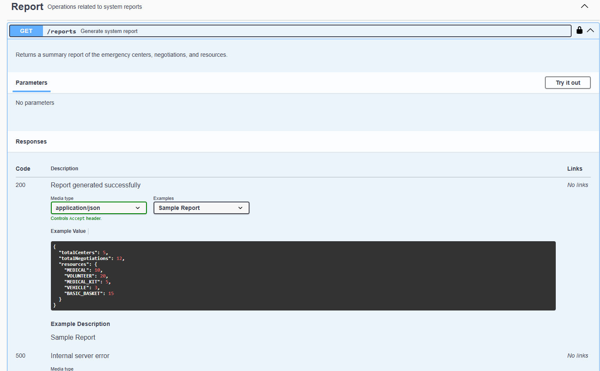

# Emergency Centers API

RESTful API for managing community centers in emergency situations (natural disasters, social crises, etc.), developed in Java 17 with Spring Boot 3+ and MongoDB.

## Features
- Registration and management of community centers
- Occupation update with notification
- Resource exchange between centers (scoring and rules)
- Advanced reports and filters
- Swagger/OpenAPI documentation
- Unit tests (JUnit 5 + Mockito)
- Full Docker support

## Running

### 1. With Docker Compose
```bash
docker-compose up --build
```
Access: http://localhost:8080/swagger-ui.html

### 2. Locally (requires Java 17, Maven, MongoDB)
```bash
mvn clean package
java -jar target/emergency-centers-api-1.0.0.jar
```

## Swagger Documentation
Access [http://localhost:8080/swagger-ui.html](http://localhost:8080/swagger-ui.html) after starting the application.

## Project Structure
- `controller/` - REST endpoints
- `service/` - Business logic
- `repository/` - Persistence (MongoDB)
- `domain/model/` - Domain models
- `dto/` - Data transfer objects
- `mapper/` - DTO <-> Model conversion (MapStruct)
- `event/` - Events and notifications
- `exception/` - Global error handling
- `config/` - General configurations
- `docs/` - Project decisions

## Decisions and Questions
See `docs/decisoes.md` for details on architectural decisions and rules.

---

## Usage Examples via Swagger

### API Overview


### Community Center Registration


### Occupation Update


### Resource Exchange


### Reports


### List Centers with >90% Occupation


### Negotiation History for Specific Center


---

> Developed for hiring processes and studies of modern microservices architecture.
